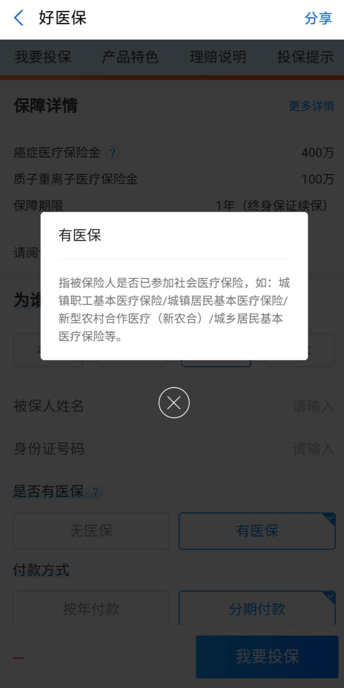
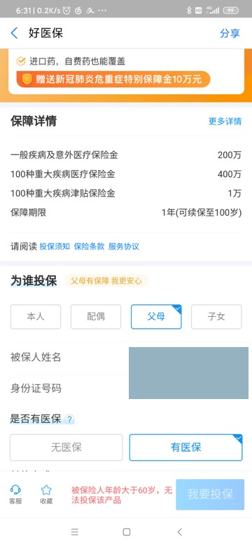
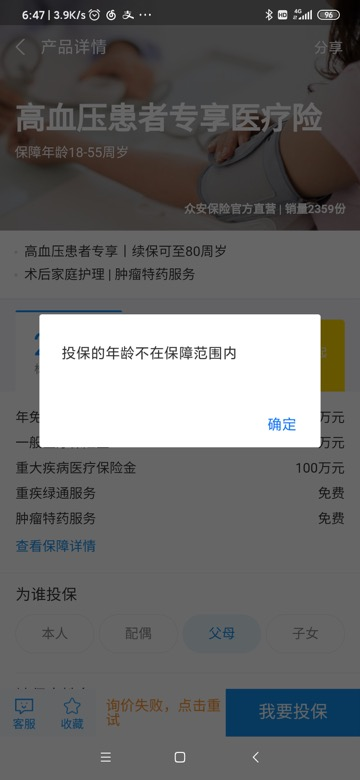
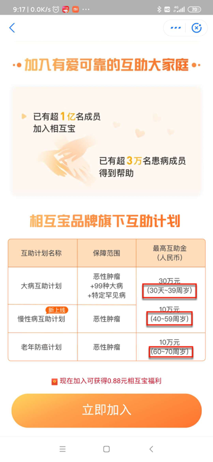
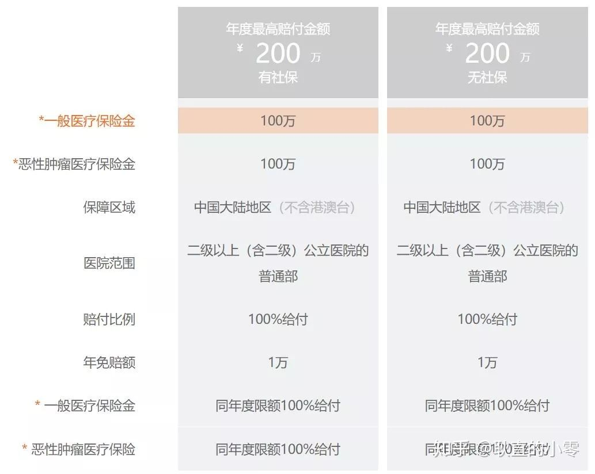
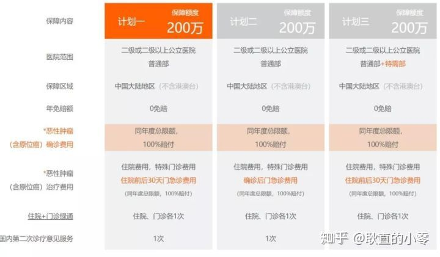

# 给父母老人买保险

## 背景

* 父母
  * 70多岁
  * 农村户口
    * 有新农合
      * 也是医保之一

## 相关知识

给父母买保险时，往往会涉及到：是否有医保

比如：

支付宝中：

有医保的说明中，也写明了：

* 有医保
  * 城镇职工基本医疗保险
  * 城镇居民基本医疗保险
  * 新型农村合作医疗（新农合）
  * 城县居民基本医疗保险

### 医保相关知识

* 医保种类
  * 职工医疗险保险
  * 城镇居民医疗保险
  * 新农合
* 特点
  * 国家的基本福利
  * 具备商业保险无法比拟的优势
    * 可带病投保
    * 保证续保
  * 说明
    * 在没有医保的情况下购买商业保险，保费会非常贵

### 老人买保险时

* 年龄 >50
  * 虽然够买保险（尤其是`重疾险`）
    * 但大多会要求体检
    * 且：`医疗险`不保证续保
* 防癌险
  * 注意：不保非癌症
    * 非癌症
      * 脑中风
      * 冠心病
      * 心肌梗塞

#### 往往超过50、60、70就无法买各种保险了

去支付宝中看了看其他的：

医疗险 和 高血压医疗险

分别都是：

70岁以上的父母，无法购买：

医疗险：被保险人年龄大于60岁，无法投保该产品

以及 专门的 高血压医疗险：投保的年龄不在保障范围内

另外，蚂蚁保险中 相互宝 也是超过60或70就无法购买：

以及支付宝的「终身防癌险」，评价是：

> 很适合给父母做长期兜底癌症风险的保障，而且，目前也应该是最适合父母人群的癌症医疗险。

但实际上：超过55岁，就不卖了

* 超过55岁，患病的概率大大增加
    * 保险公司如果保，基本都是亏本

所以目前看来，还真是：

超过60，尤其是70，只能买：

`意外险` 和 `癌症医疗险` 了

## 结论

`70多`岁能购买的保险：

* 优先选择：`意外险`
* 其次可以考虑
  * `防癌险`
  * `癌症医疗险`
* 说明
  * `重疾险`：一般很难买到 -> 即使想买，往往也没有卖的
    * 能买到的，往往都很贵 -> 很不划算

### 更多细节

* 推荐
  * 父母身体健康，无体检异常
    * 百万医疗险
      * 推荐产品
        * 微信微医保
        * 支付宝好医保
        * 平安健康的e生保
        * 众安尊享e生
      * 特点
        * 保额：癌症报销上限200万，其他疾病报销上限100万（免赔额1万）
        * 报销范围：不限社保目录，不限治疗手段，新特药都能报销
        * 续保条件好：患病后还能继续买，医疗费用还能继续报销
      * 举例
        * 
  * 父母身体健康有恙，不满足百万医疗险的投保条件
    * 防癌医疗险
      * 推荐产品
        * 平安抗癌卫士2018
        * 众安孝欣保老年恶性肿瘤保险
        * 安心安享一生（尊享版）
      * 特点
        * 投保年龄宽松
          * 首次投保年龄放宽到70岁，个别产品甚至到80岁
        * 健康告知宽松
          * 三高、糖尿病、冠心病等常见的慢性病也能投保，非常适合老年人。
        * 癌症高发
          * 大病中癌症的占比超过60%，防癌医疗险也算覆盖了大部分风险
      * 举例
        * 

目前结论：

* 给70多岁的父母，且有三高症状的，购买：
  * `意外险`
  * `防癌医疗险`

不过，对于父母有高血压等情况，能否购买 医疗险 需要购买前确认一下

