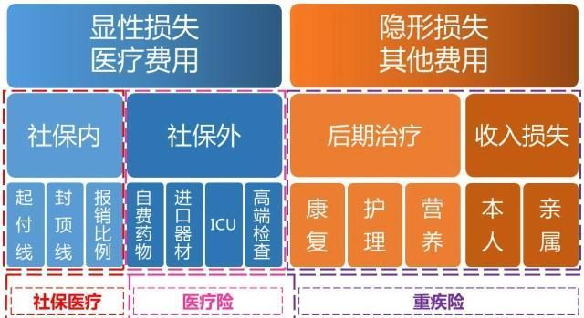
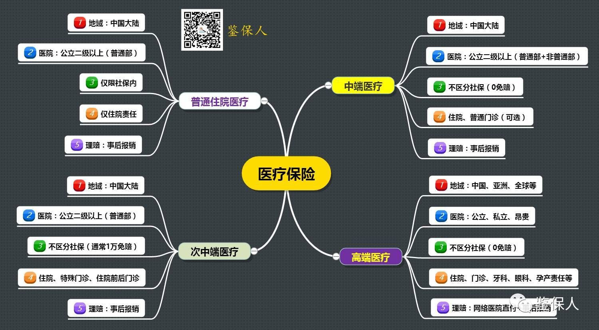
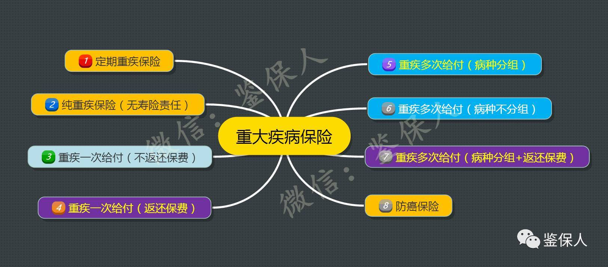
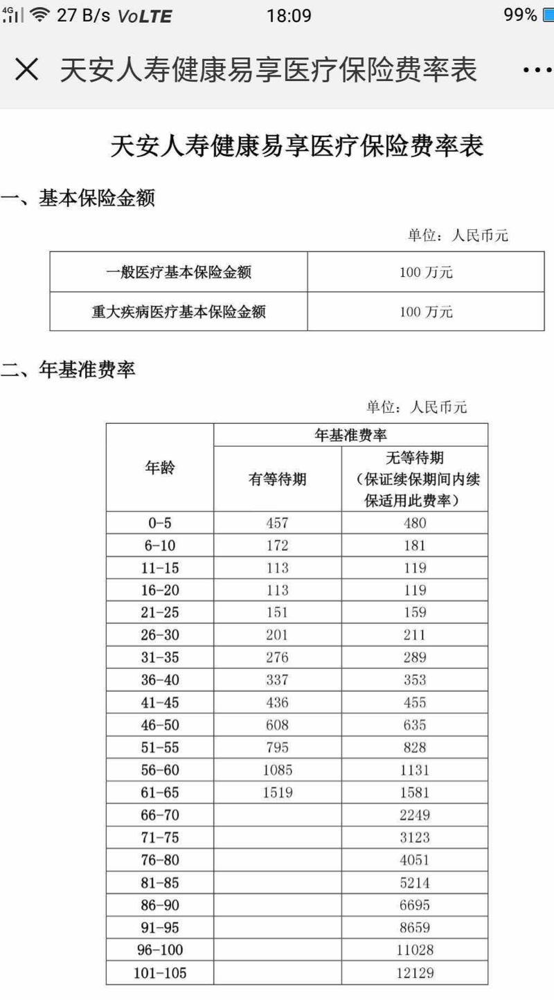
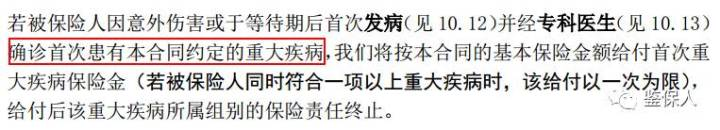
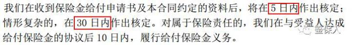
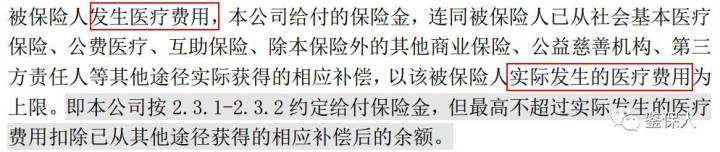

# 医疗险 vs 重疾险

## 社保 vs 医疗险 vs 重疾险

## 医疗险 vs 重疾险

* 医疗险
  * 
* 重疾险
  * 

对比：

| 类型 | 重疾险=大病险 | 住院险=医疗险=住院医疗险 |
| --- | --------------- | -------------------------- |
| （续保规定）购买和缴费形式 | 均衡费率：每年的保费、缴费期限、保障期限从一开始就确定了，保障的总额也确定了。相对医疗险而言，重疾险产品对于重大疾病的针对性保障，确定性更强    只用买一次，签一个合同，交10年（20年，30年等），可以选保70岁还是终身  价格是每年交 固定的钱   =交20年，保一辈子（比如30岁到80岁也有50年） | 自然费率。买一年，保一年。保费随着被保险人年龄而不断增长   合同只能按年签和一年交一次费用  随着年龄增大，价格增加增加 =交1年，保1年，不交，不保   年纪大了，比如超过70（80，90等），基本上也无法购买，或者存在无法续保的风险|
| 价格 | 举例  （1）百年人寿 女 32周岁 交20年 保10万 +保特定疾病：1400左右  （2）天安人寿 女 32周岁 交20年 保11万 +保特定疾病：2600+ 最多赔付6次（不同种类重疾）| 举例  一般疾病医疗保100万 重大疾病医疗保100万 女 32周岁->300元左右/年 年级越大，越贵些   |
| 赔付形式 | 先赔 | 后赔 |
| 赔多少 | 你买多少，就赔多少 比如买了20万，就直接赔20万  对于保险金的使用，没有做要求，被保险人可以自行处理，可以用作疾病治疗，也可用作其他途径。  得了重疾，属于保险范围，直接赔你20万，你拿这20万，可以先去治疗之前或早期就能拿这钱去看病。| 不超过总医疗费用支出 花多少，报多少  比如：  某次住院，花了10万元（都属于保险责任），其中8万属于社保范围，2万属于社保外费用（比如自费药等）。社保范围部分使用社保报销了6万，剩余2万。若是使用不限社保报销、100%赔付的医疗险产品，则可以将剩余的4万全部进行理赔 |
| 主要目的和特点 | 事前支持 确诊首次患病即可理赔 | 事后补救 费用补偿型 |
| 理赔条件和注意事项 | 某重疾险 保险责任规定     某重疾险 保险金申请规定  | 某医疗险 保险金申请规定  |
| 保险责任、疾病程度要求 | 重疾险的疾病，一般程度都比较严重，需要的治疗资金、康复时间、持续治疗要求都比较高  相对而言，重疾险主要责任简单，对于主要责任的定义和标准，各家公司都比较类似，相对也容易理解 | 保险责任覆盖范围更广，不区分是意外或疾病，不区分是否达到某种疾病规定的程度或理赔条件（如重大疾病），只要是合理且必须的医疗费用支出，就可申请理赔，理赔条件更加宽泛  但同时，医疗险的细分责任、各项费用限额规定非常细致，有的费用设置了赔付限额或赔付比例。并不意味着医疗险责任范围内就可以全部理赔 |

-》

医疗险和重疾险结合，可以提供差异化的保障，覆盖更广的保险责任：

* 非重疾的一般住院费用，医疗险可以解决
* 重大疾病的费用，先用重疾险，再用医疗险

结论：

* 一般有条件的话，最好优先购买重疾险，属于大病的保障，也是大头 
  * 费用：一年要1000，2000多，或更多
  * 收益：万一大病，直接赔你10万，20万或更多，你好看病，而且是提前给钱
* 其次也可以考虑，购买住院医疗险作为补充，
  * 费用：年轻时30岁前后，一年也就300多，年纪大些400，600直到1000多
  * 收益：有病住院康复后，才能根据情况赔付，比如10万中除去医保的6万，还剩4万中的全部，也就4万，而且还是事后赔付

## 重疾险 vs 特定疾病 vs 住院医疗

* `重疾险`=`重大疾病`：确定重疾即可获准赔付，为治疗提供经济支持
  * 专门保 重大疾病的
    * 重大疾病 国家规定 最少6种，一般是25种
    * 现在很多险种都推出保100种重疾的
* `特定疾病`：专注于特定疾病，确诊即可获准赔付，为治疗提供经济支持
  * 现在很多险种都推出保 30种或50种 特定疾病的
  * 赔付金额基本上都是 重疾保额的20%或30%
    * 比如保10万重疾的，搭配保20万*25%=5万 特定疾病
* `住院医疗` = `医疗险`：住院治疗期间必要合理的医疗费用津贴或费用报销
  * 免赔额：
    * 额度：
      * 一般都有，比如1万
        * 1万以内都不算，都不给赔
        * 超过1万的才算
      * 也有没有免赔额的
    * 时间：
      * 年度免赔额一般是1万
      * 重疾0免赔额
  * 报销比例：
    * 一般分：
      * 有社保：除去社保报销后，剩下的，一般都陪100%
      * 无社保：按60%比例报销
  * 购买年限：都是1年交一次费
    * 只能按年买，不支持（像重疾险那种）一次性买很多年的
      * 因为风险很大，报销公司每年根据评估后，价格略有不同
  * 多少岁可以买
    * 分少儿的：0或多少天，比如30天到-17周岁
    * 和成人的
      * 一般都是18岁到 60岁
  * 能买到多少岁
    * 一般都是60岁，65岁左右
      * 年纪再大之后，就更容易得病住院，保险公司的风险就大了，就容易亏钱，所以就不愿意卖这种保险了

## 很多保险看似保额很高，但是限制条件很多

* 限制条件，专业术语叫做：`免责条款`
  * 出了事情，如果是符合这些条件：
    * 保险公司是免除责任
    * 即没有责任
    * 等于：不赔
* -》发生到你身上，又符合条款的，概率很低
* -》换句话说，往往你得了病，出了险，去理赔，由于不符合条件，往往不赔
  * 这倒不是保险公司的问题，而是你自己没看清保险条款的问题
* 所以如果有些保险，免责条款很少的话，那就是大大的优点了
  * 比如：
  * 百年定惠保定期寿险-开心保保险网
    * http://www.kaixinbao.com/renshou-baoxian/313866.shtml
  * 定寿险，往往都是：免责条款很少
    * 

更加典型的是：

* 重疾险：往往看起来很贵，而且保障的额度不是那么高
  * 比如30岁左右，交20年，保20万，保终身，一般要3000+元/年
* 住院险=住院医疗险=住院津贴：看起来很便宜
  * 比如一般保100万，200万，300万的，一年只要200多，300多
但是实际上：
* 重疾险：
  * 保障时间长：一般都是保障终身，或者保障到70岁
  * 每年缴费额是固定的，不变的
  * 限制条件相对较少
  * 事前赔付：医生确诊后，即可赔你钱
* 住院险
  * 保障时间短：都是一年交一次钱
  * 年轻时交的钱，的确是少，年纪越大，交的越多
    * 年纪大到40多岁，50多岁，一年也要1000多，2000多了
    * 更主要的是：60岁，70岁，80岁等更大年纪，根本不卖
      * 因为保险公司你老年人住院风险很大，卖你会亏钱
  * 限制条件相对较多
    * 有免赔额，和其他限制
  * 事后赔付：你看完病，社保（如果有）报销后，再去找其理赔

所以算下来：

住院险，只是给你年轻人的辅助保险，年老了还买不了

真正保你的，是重疾险，真正得重大疾病了，才赔你钱，你才能先拿钱看病
