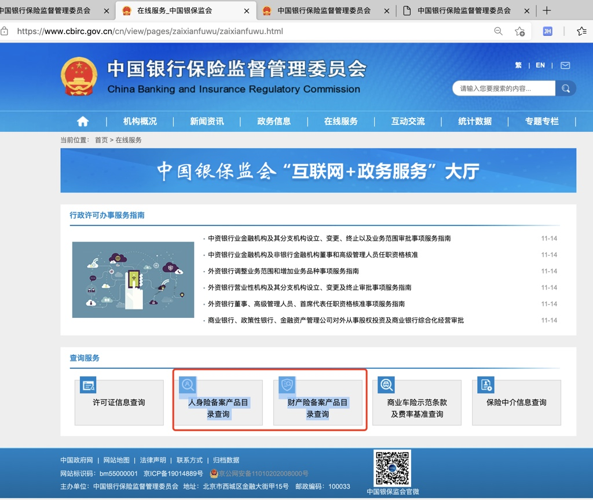

# 官方备案的保险公司

## 中国现有备案的保险公司

* 前面已述：保险公司`牌照`是**稀缺资源**
  * 保险法规定至少要有2亿元人民币实缴资本
  * 现实中没有20亿以上真金白银是很难办成这事的
    * 即使这20亿元不是问题，如果出资股东背景鱼龙混杂，那拿牌照一样不会是容易事

对于中国现在有哪些保险公司，可以从官网查到：

* 银保监会 官网
  * http://www.cbrc.gov.cn/chinese/newIndex.html
->
* 中国银行保险监督管理委员会
  *  http://www.cbrc.gov.cn/chinese/split/xxgk.html
->
* 中国保险监督管理委员会 > 政府信息公开
  * http://bxjg.circ.gov.cn/tabid/5272/Default.aspx?type=mulu
->
* 2018年
  * 2018年1-6月人身保险公司原保险保费收入情况表 - 中国保险监督管理委员会
    * http://bxjg.circ.gov.cn/tabid/5171/InfoID/4116890/Default.aspx?type=Apply
      * 共**88**家`寿险公司`
  * 2018年1-6月财产保险公司原保险保费收入情况表 - 中国保险监督管理委员会
    * http://bxjg.circ.gov.cn/tabid/5171/InfoID/4116888/Default.aspx?type=Apply
      * 共**87**家`财险公司`
* 2020年
  * 中国银保监会办公厅关于进一步加强和改进财产保险公司产品监管有关问题的通知_保险_中国政府网
    * http://www.gov.cn/zhengce/zhengceku/2020-03/26/content_5495813.htm
      * 共**88**家`财险公司`
* 最新：2021年4月
  * 官网底部有查询入口
    * 在线服务_中国银保监会
      * https://www.cbirc.gov.cn/cn/view/pages/zaixianfuwu/zaixianfuwu.html
        * 
