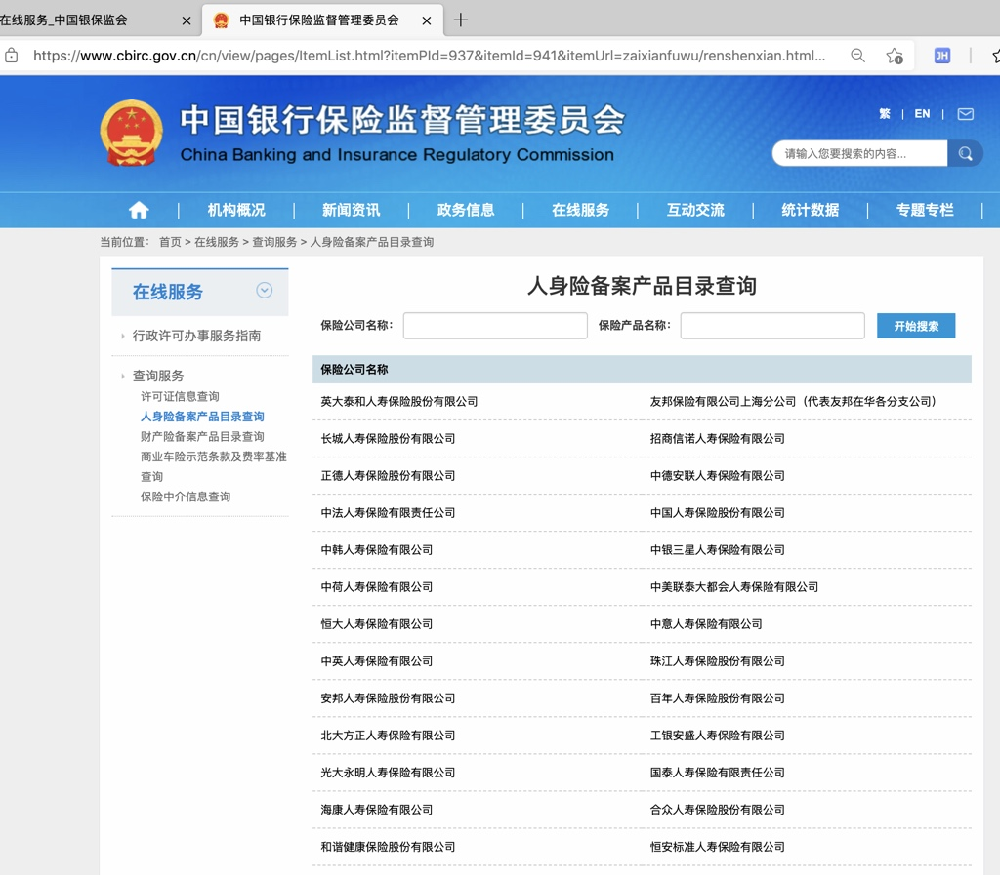

# 人身险公司

从[银保监会 在线服务](https://www.cbirc.gov.cn/cn/view/pages/zaixianfuwu/zaixianfuwu.html)进入后可以查到：

* [人身险备案产品目录查询](https://www.cbirc.gov.cn/cn/view/pages/ItemList.html?itemPId=937&itemId=941&itemUrl=zaixianfuwu/renshenxian.html&itemName=%E4%BA%BA%E8%BA%AB%E9%99%A9%E5%A4%87%E6%A1%88%E4%BA%A7%E5%93%81%E7%9B%AE%E5%BD%95%E6%9F%A5%E8%AF%A2)
  * 

截止`20210415`，整理出来：

* 共`116`家人身险公司
  * 其中部分名称有重复，实际估计`不到100家`
* 列表如下

```bash
英大泰和人寿保险股份有限公司
友邦保险有限公司上海分公司（代表友邦在华各分支公司）
长城人寿保险股份有限公司
招商信诺人寿保险有限公司
正德人寿保险股份有限公司
中德安联人寿保险有限公司
中法人寿保险有限责任公司
中国人寿保险股份有限公司
中韩人寿保险有限公司
中银三星人寿保险有限公司
中荷人寿保险有限公司
中美联泰大都会人寿保险有限公司
恒大人寿保险有限公司
中意人寿保险有限公司
中英人寿保险有限公司
珠江人寿保险股份有限公司
安邦人寿保险股份有限公司
百年人寿保险股份有限公司
北大方正人寿保险有限公司
工银安盛人寿保险有限公司
光大永明人寿保险有限公司
国泰人寿保险有限责任公司
海康人寿保险有限公司
合众人寿保险股份有限公司
和谐健康保险股份有限公司
恒安标准人寿保险有限公司
华汇人寿保险股份有限公司
汇丰人寿保险有限公司
吉祥人寿保险股份有限公司
君龙人寿保险有限公司
昆仑健康保险股份有限公司
利安人寿保险股份有限公司
民生人寿保险股份有限公司
农银人寿保险股份有限公司
平安健康保险股份有限公司
中国平安人寿保险股份有限公司
平安养老保险股份有限公司
前海人寿保险股份有限公司
中国人民健康保险股份有限公司
中国人民人寿保险股份有限公司
瑞泰人寿保险有限公司
生命人寿保险股份有限公司
太平人寿保险有限公司
中国太平洋人寿保险股份有限公司
太平养老保险股份有限公司
泰康人寿保险股份有限公司
泰康养老保险股份有限公司
天安人寿保险股份有限公司
新光海航人寿保险有限责任公司
新华人寿保险股份有限公司
幸福人寿保险股份有限公司
阳光人寿保险股份有限公司
国华人寿保险股份有限公司
弘康人寿保险股份有限公司
中融人寿保险股份有限公司
华夏人寿保险股份有限公司
中邮人寿保险股份有限公司
德华安顾人寿保险有限公司
交银康联人寿保险有限公司
建信人寿保险有限公司
信诚人寿保险有限公司
信泰人寿保险股份有限公司
东吴人寿保险股份有限公司
华泰人寿保险股份有限公司
长生人寿保险有限公司
复星保德信人寿保险有限公司
中宏人寿保险有限公司
安邦养老保险股份有限公司
渤海人寿保险股份有限公司
陆家嘴国泰人寿保险有限责任公司
太保安联健康保险股份有限公司
富德生命人寿保险股份有限公司
国联人寿保险股份有限公司
上海人寿保险股份有限公司
同方全球人寿保险有限公司
君康人寿保险股份有限公司
中华联合人寿保险股份有限公司
横琴人寿保险有限公司
和泰人寿保险股份有限公司
复星联合健康保险股份有限公司
华贵人寿保险股份有限公司
信美人寿相互保险社
招商局仁和人寿保险股份有限公司
爱心人寿保险股份有限公司
中航三星保险有限公司
中新大东方人寿保险有限公司
中信保诚人寿保险有限公司
三峡人寿保险股份有限公司
北京人寿保险股份有限公司
国宝人寿保险股份有限公司
海保人寿保险股份有限公司
国富人寿保险股份有限公司
瑞华健康保险股份有限公司
陆家嘴国泰人寿保险有限公司
鼎诚人寿保险有限责任公司
泰康人寿保险有限责任公司
建信人寿保险股份有限公司
大家人寿保险股份有限公司
大家养老保险股份有限公司
友邦人寿保险有限公司
财信吉祥人寿保险股份有限公司
财信人寿
太平洋人寿
和谐健康
前海人寿
幸福人寿
利安人寿
信泰人寿
招商仁和人寿
弘康人寿
英大泰和人寿
东吴人寿
泰康人寿
国联人寿
新华保险
上海人寿
```
