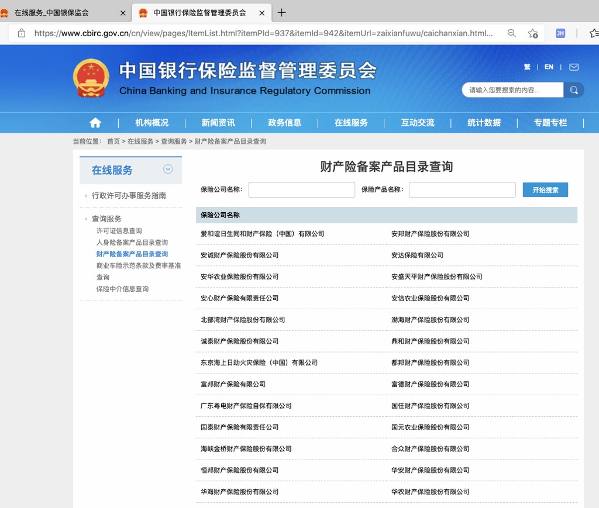

# 财产险公司

从[银保监会 在线服务](https://www.cbirc.gov.cn/cn/view/pages/zaixianfuwu/zaixianfuwu.html)进入后可以查到：

* [财产险备案产品目录查询](https://www.cbirc.gov.cn/cn/view/pages/ItemList.html?itemPId=937&itemId=942&itemUrl=zaixianfuwu/caichanxian.html&itemName=%E8%B4%A2%E4%BA%A7%E9%99%A9%E5%A4%87%E6%A1%88%E4%BA%A7%E5%93%81%E7%9B%AE%E5%BD%95%E6%9F%A5%E8%AF%A2)
  * 

截止`20210415`，整理出来：

* 共`88`家财产险公司
* 列表如下：

```bash
爱和谊日生同和财产保险（中国）有限公司
安邦财产保险股份有限公司
安诚财产保险股份有限公司
安达保险有限公司
安华农业保险股份有限公司
安盛天平财产保险股份有限公司
安心财产保险有限责任公司
安信农业保险股份有限公司
北部湾财产保险股份有限公司
渤海财产保险股份有限公司
诚泰财产保险股份有限公司
鼎和财产保险股份有限公司
东京海上日动火灾保险（中国）有限公司
都邦财产保险股份有限公司
富邦财产保险有限公司
富德财产保险股份有限公司
广东粤电财产保险自保有限公司
国任财产保险股份有限公司
国泰财产保险有限责任公司
国元农业保险股份有限公司
海峡金桥财产保险股份有限公司
合众财产保险股份有限公司
恒邦财产保险股份有限公司
华安财产保险股份有限公司
华海财产保险股份有限公司
华农财产保险股份有限公司
华泰财产保险有限公司
黄河财产保险股份有限公司
汇友财产相互保险社
建信财产保险有限公司
锦泰财产保险股份有限公司
京东安联财产保险有限公司
久隆财产保险有限公司
劳合社保险（中国）有限公司
乐爱金财产保险（中国）有限公司
利宝保险有限公司
美亚财产保险有限公司
日本财产保险（中国）有限公司
日本兴亚财产保险（中国）有限责任公司
融盛财产保险股份有限公司
瑞再企商保险有限公司
三井住友海上火灾保险（中国）有限公司
三星财产保险（中国）有限公司
史带财产保险股份有限公司
苏黎世财产保险（中国）有限公司
太平财产保险有限公司
太平科技保险股份有限公司
泰康在线财产保险股份有限公司
泰山财产保险股份有限公司
天安财产保险股份有限公司
现代财产保险（中国）有限公司
新疆前海联合财产保险股份有限公司
鑫安汽车保险股份有限公司
信利保险（中国）有限公司
亚太财产保险有限公司
燕赵财产保险股份有限公司
阳光财产保险股份有限公司
阳光农业相互保险公司
阳光信用保证保险股份有限公司
阳光渝融信用保证保险股份有限公司
易安财产保险股份有限公司
英大泰和财产保险股份有限公司
永安财产保险股份有限公司
永诚财产保险股份有限公司
长安责任保险股份有限公司
长江财产保险股份有限公司
浙商财产保险股份有限公司
中国出口信用保险公司
中国大地财产保险股份有限公司
中国平安财产保险股份有限公司
中国人民财产保险股份有限公司
中国人寿财产保险股份有限公司
中国太平洋财产保险股份有限公司
中国铁路财产保险自保有限公司
中航安盟财产保险有限公司
中华联合财产保险股份有限公司
中路财产保险股份有限公司
中煤财产保险股份有限公司
中石油专属财产保险股份有限公司
中意财产保险有限公司
中银保险有限公司
中原农业保险股份有限公司
中远海运财产保险自保有限公司
众安在线财产保险股份有限公司
众诚汽车保险股份有限公司
众惠财产相互保险社
珠峰财产保险股份有限公司
紫金财产保险股份有限公司
```
