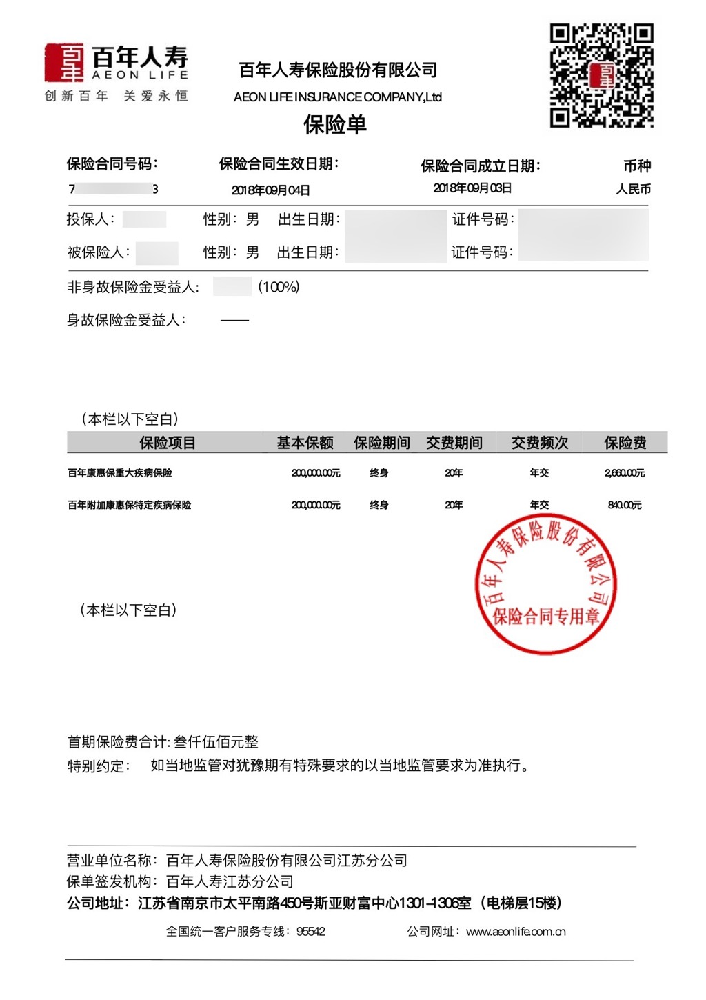
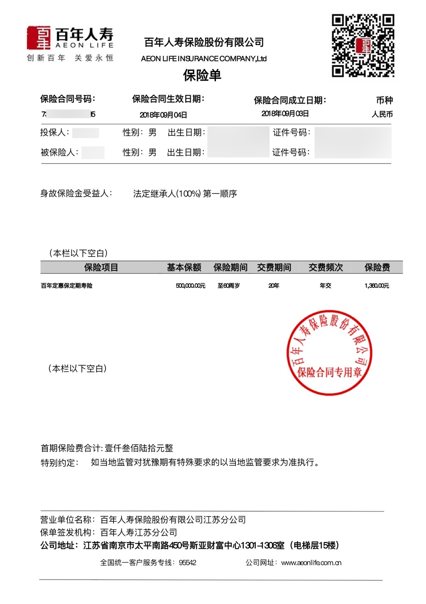
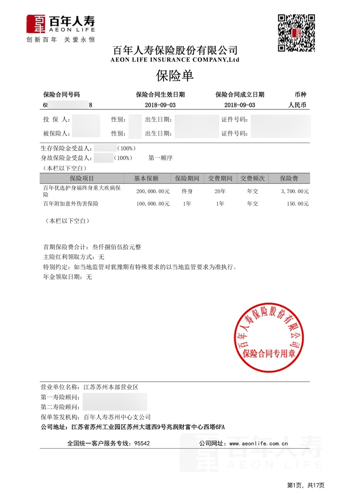

# 百年人寿

## 自己的主险配置

概述：

* 共 8710元/年
  * 男： 共4860元/年
    * 保险生效日：`2018-09-04`
    * 重疾险
      * 百年康惠保重大疾病保险：2660元/年 保20万
      * 百年附加康惠保特定疾病保险：840元/年 保20万
    * 定寿险
      * 百年定惠保定期寿险 交20年 保到60岁：1360元/年 保50万
  * 女： 共 3850元/年
    * 保险生效日：`2018-09-03`
    * 重疾险
      * 百年优选护身福终身重大疾病保险：3700元/年 保20万
    * 意外险
      * 百年附加意外伤害保险：150元/年 保10万

详解：

* 男：`重疾`+`定寿`
  * `重疾` + `轻症`(特定疾病)
    * 细节
      * `百年康惠保重大疾病保险`
        * 保额：20万
        * 缴费期间：20年
        * 保费：2660元/年
      * `百年附加康惠保特定疾病保险`
        * 保额：20万
        * 缴费期间：20年
        * 保费：840元/年
    * 保单
      * 
  * `定寿`
    * `百年定惠保定期寿险`
      * 细节
        * 保额：50万
        * 缴费期间：20年
        * 保险期间：到69周岁
        * 保费：1360元/年
      * 保单
        * 
* 女：`重疾`+`意外`
  * 细节
    * `百年优选护身福终身重大疾病保险`
      * 保额：20万
      * 保险期间：终身
      * 缴费期间：20年
      * 保费：3700元/年
    * `百年附加意外伤害保险`
      * 保额：10万
      * 保险期间：1年
      * 缴费期间：1年
      * 保费：150元/年
  * 保单
    * 
