# 帮朋友选男性重疾险

## 背景

男 31岁，帮忙让我研究 重疾险

最好2021年1月31号之前买，能享受之前的重疾政策

## 结论

* 百年人寿
  * 来源：百年人寿 小程序
  * 产品
    * 百年康惠保（2.0版本）重大疾病保险
      * 保障：重症+中症+轻症+前症+第二次恶性肿瘤保险金
      * 价格：交20年 保终身 保额20万
        * 最低价格：3298元/年
        * 加 身故保险金：4990元/年
    * 百年康惠保重大疾病保险
      * 保障：100重重疾
      * 价格：交20年 保终身 保额20万
        * 最低价：1880元/年
    * 百年康惠保保险产品组合计划
      * 保障：100种重疾+30种特定疾病
      * 价格：交20年 保终身 保额20万
        * 最低价：3140元/年
* 阳光人寿
  * 来源：
    * 阳光保险 公众号
      * 
    * 阳光保险 [官网](https://www.sinosig.com/)
      * https://www.sinosig.com/
  * 产品
    * i保重疾保险 多倍赔付版
      * 保障：重疾+额外重疾+中症+轻症+豁免保费+身故保险金
      * 价格：5216元/年
    * 健康随e保重疾保障计划（成年人版）
      * 保障：重疾+轻症+豁免保费
      * 价格：交20年 保终身 保额20万
        * 最低价：3580元/年
* 信泰保险
  * 来源：网站 或 [移动端页面](https://www.700du.cn/m/index.html?code=031shJFa1W9jpA00ZwJa1uU6Z70shJFj&state=STATE#/product/0f2f99192b284f7483e05b5a13a16a56?isShowHead=1&isShowPrice=0&akey=df1f35ec06634e989717eceb07eb9e5f&userSelectData=%7B%22skuNo%22%3A%22SKU051537779052544QQ%22%7D&version=3.55&fromType=6&guuid=161077471024489121)
  * 产品
    * 信泰超级玛丽重疾险3号Max
      * 保障：重疾+中症+轻症
      * 价格：
        * 交20年 保终身 保额20万
          * 最低价：3092元/年
          * 加 第二次恶性肿瘤保险金：3402元/年
          * 加 第二次恶性肿瘤保险金 + 投保人豁免：3558.83元/年
          * 加 身故或全残保险金：4604元/年
        * 交20年 保终身 保额30万
          * 最低价：4638元/年

## 选择过程

帮忙挑选的详细过程见下：

去 百年人寿 小程序中看看

主页：

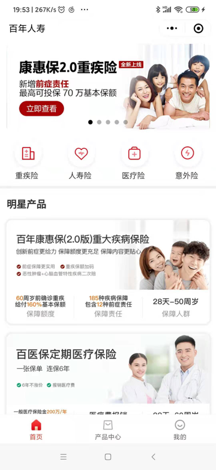

重疾险产品列表：

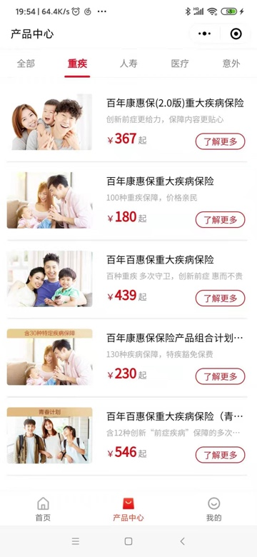

第一个：

百年康惠保（2.0版本）重大疾病保险

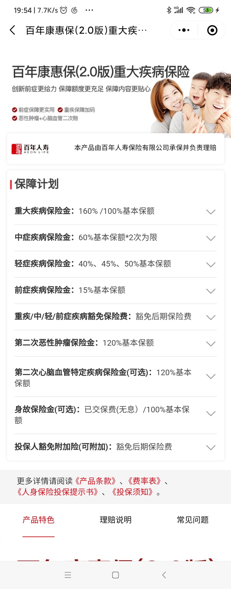

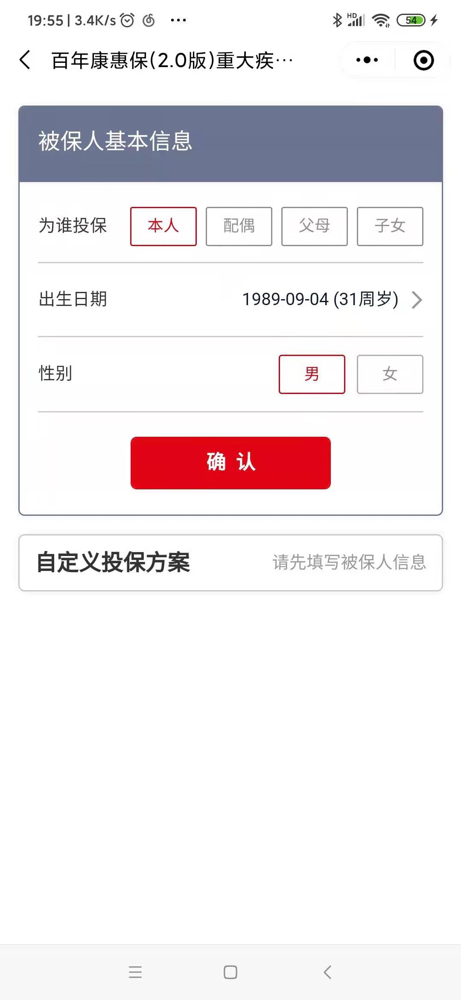

交20年 保终身 保额20万

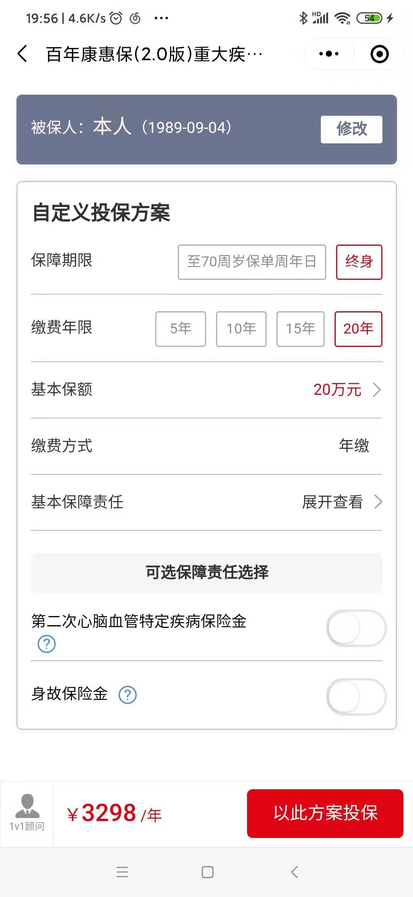

关于 身故保险金 的解释：

重疾险 身故保险金

加上 身故保险金 后 贵很多：

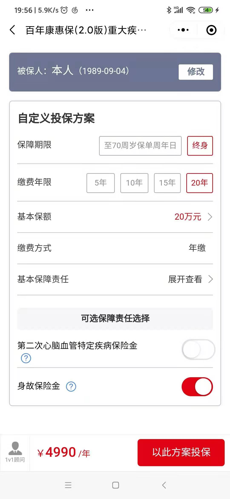

第二个：

百年康惠保重大疾病保险

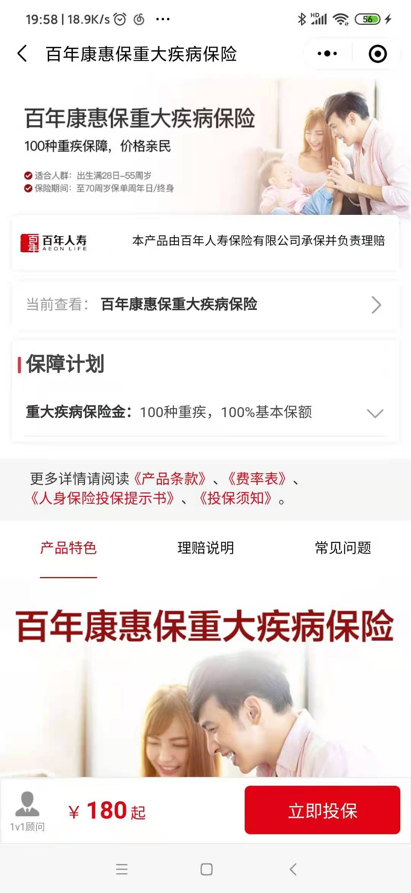

保终身 交30年 保20万

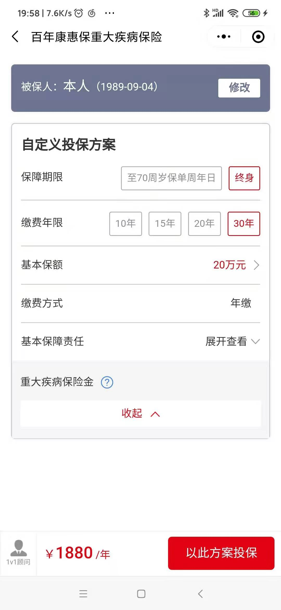

第四个：

百年康惠保保险产品组合计划 100种重疾+30种特定疾病

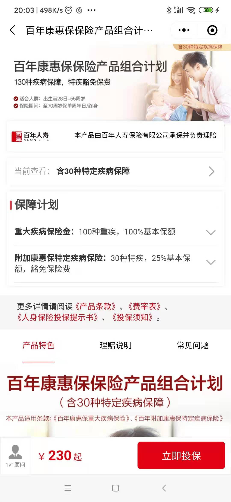

保终身 交20年 保20万，要：3140元

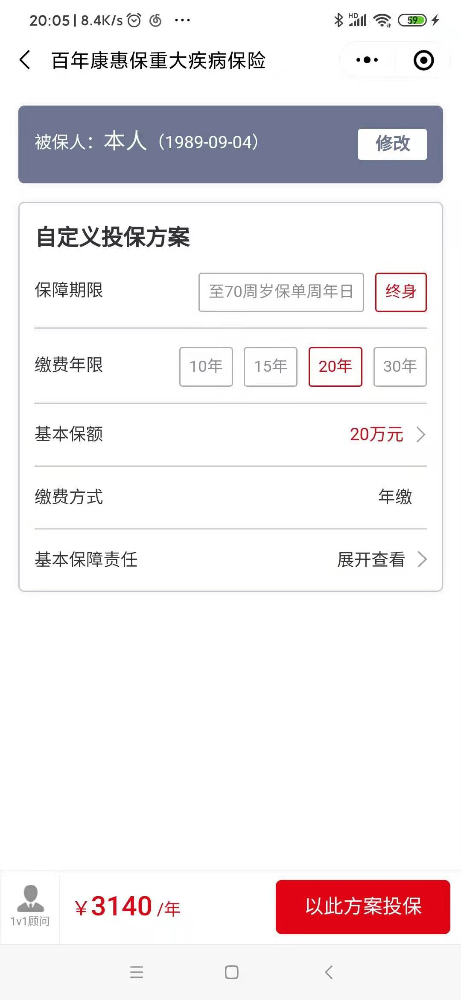

保险 在线购买

[阳光保险官方网站_保险,网上购买,保险理赔,值得信赖的保险公司](https://www.sinosig.com)

[阳光热销互联网重疾险](https://event.sinosig.com/topic/pre/pc4/zj/index.html)

[i保重大疾病保险(多倍赔付版)-阳光保险官网](https://event.sinosig.com/topic/pre/pc4/zibBpc/index.html?WT.ac_id=GW_sosuo_collection_1023/zhongji/20201125&utm_source=GW&utm_medium=sosuo_collection&utm_content=1023/zhongji/20201125)

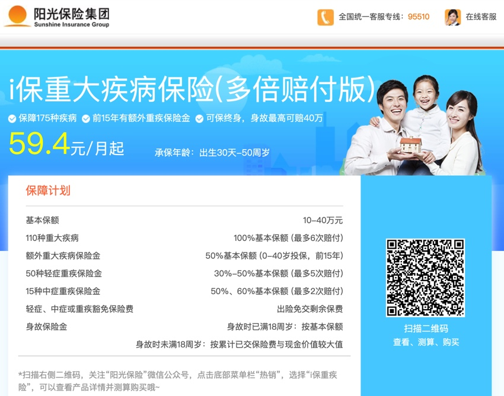

* 基本保额  10-40万元
* 110种重大疾病  100%基本保额 (最多6次赔付)
* 额外重大疾病保险金  50%基本保额 (0-40岁投保，前15年)
* 50种轻症重疾保险金  30%-50%基本保额 (最多5次赔付)
* 15种中症重疾保险金  50%、60%基本保额 (最多2次赔付)
* 轻症、中症或重疾豁免保险费  出险免交剩余保费
* 身故保险金  身故时已满18周岁：按基本保额

扫码后，去看看：

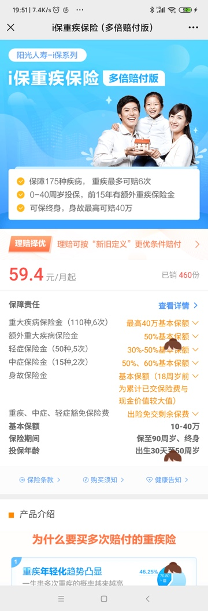

保终身 交20年 保20万，要：5216元

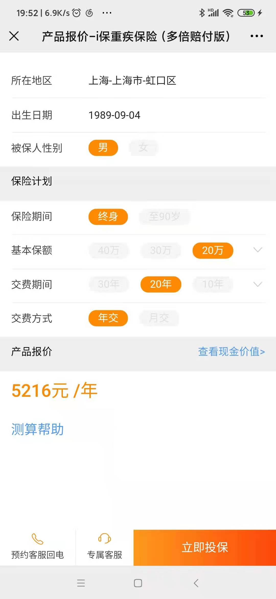

[健康随e保重疾保障计划（成年人版）_重大疾病_长期保险-阳光保险](https://product.sinosig.com/product/2021.html)

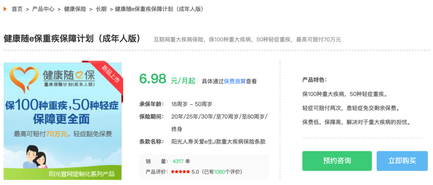

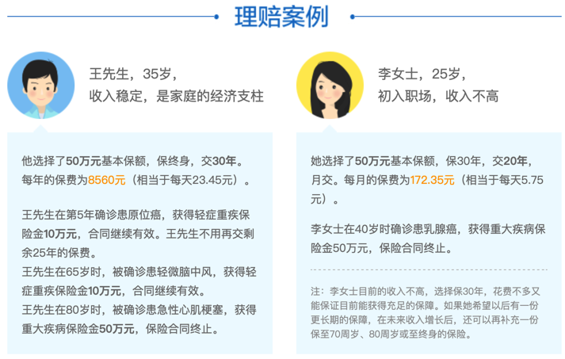

[报价页_健康随e保重疾保障计划（成年人版）](https://product.sinosig.com/longTermInsurance_quote.action?productId=2021&planId=2765&processId=buy-process-0e3f7d54-b420-4c1d-a89f-a94beb7e79d3&orderSource=product-center&platform=pc&statisticProductType=02&statisticProductId=2021)

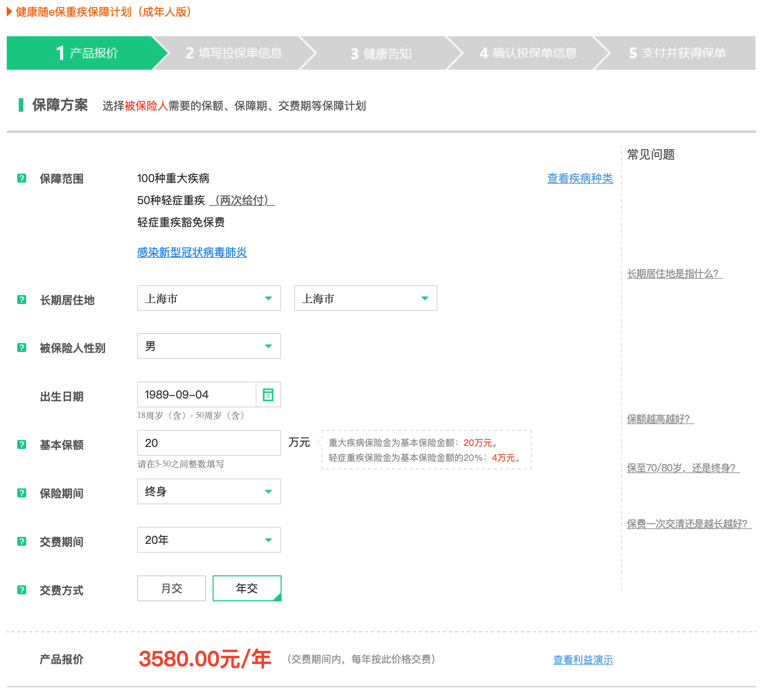

[人寿保险公司_寿险-中国太平洋人寿保险官方网站](http://life.cpic.com.cn/xrsbx/?hit=ShouyeDhGsRsbx)

[金福人生保险产品计划](http://www.cpic.com.cn/market/c/2019-07-23/1581035.shtml)

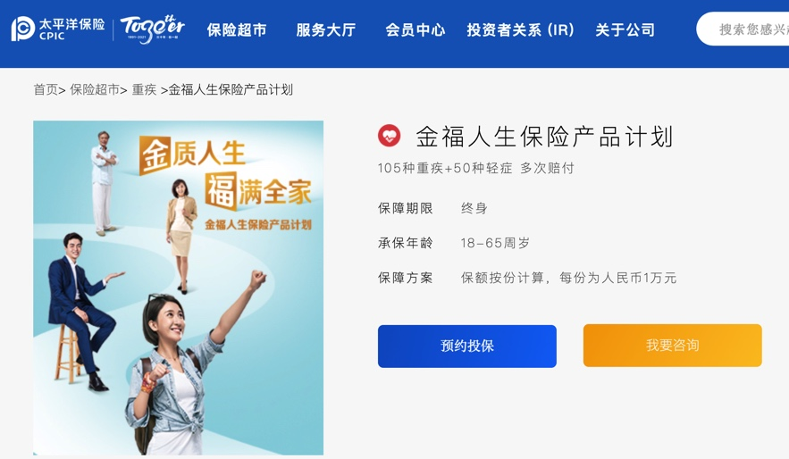

[平安保险在线投保指南-购买车险指南-中国平安官方直销网站](http://baoxian.pingan.com/baoxianfuwu/toubaozhinan.shtml)

[E生平安·重疾险_平安好生活保险商城](http://baoxian.pingan.com/product/eshengpinganzhongjixian.shtml)

[报价 - 平安·E生平安·重疾险 - 平安保险商城](https://baoxian.pingan.com/pa18shopnst/dynamic/apply.shtml?productCode=ZP020086&WT.mc_id=baoxian.pingan.com)

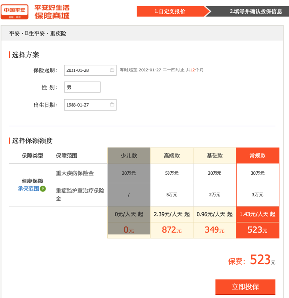

找到网上也有：

[成人重大疾病保险_疾病保险_重疾险_看病保险_在线投保购买_慧择保险网](https://www.huize.com/product/ins-2059-0-0)

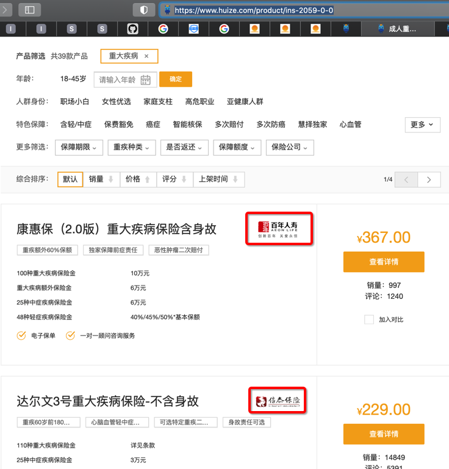

除了百年 也有 信泰保险

[达尔文3号重大疾病保险-不含身故 - 信泰人寿保险股份有限公司 - 慧择保险网](https://www.huize.com/apps/cps/index/product/detail?DProtectPlanId=104531&prodId=101961&planId=104531)

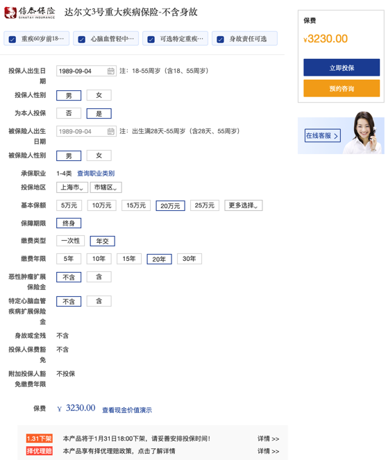

和其朋友给的：

[信泰超级玛丽重疾险3号Max](https://www.700du.cn/m/index.html?&code=031shJFa1W9jpA00ZwJa1uU6Z70shJFj&state=STATE#/product/0f2f99192b284f7483e05b5a13a16a56?isShowHead=1&isShowPrice=0&akey=df1f35ec06634e989717eceb07eb9e5f&userSelectData=%7B%22skuNo%22%3A%22SKU051537779052544QQ%22%7D&version=3.55&fromType=6&guuid=161077471024489121)

价格类似：

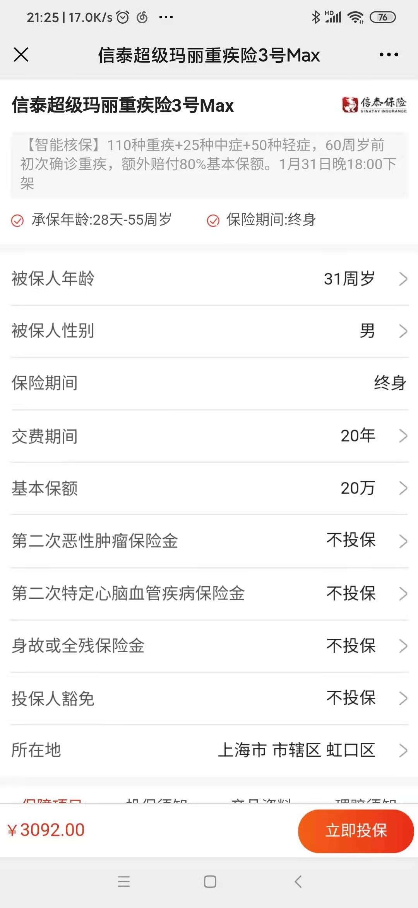

加上：第二次恶性肿瘤保险金 3402

加上：

* 第二次恶性肿瘤保险金 
* 投保人豁免

是：`3558.83`

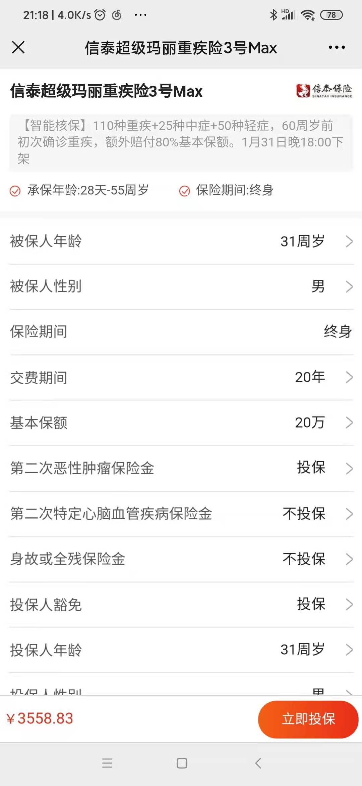

只加：身故或全残 保险金，是：`4604`

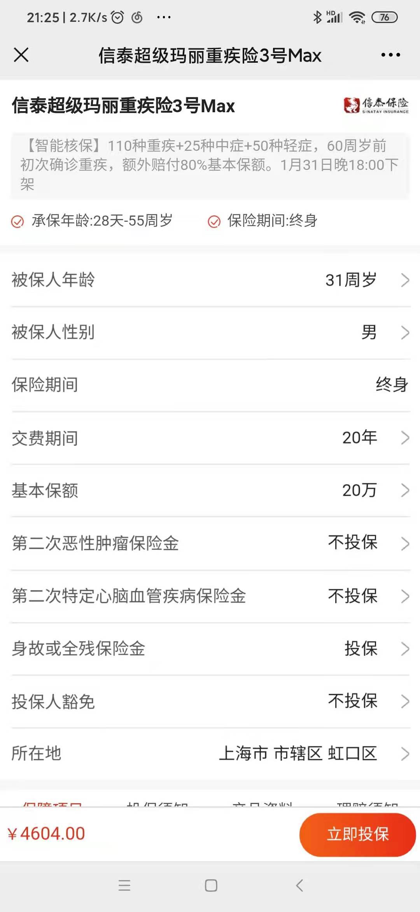

保额30万则是：4638元

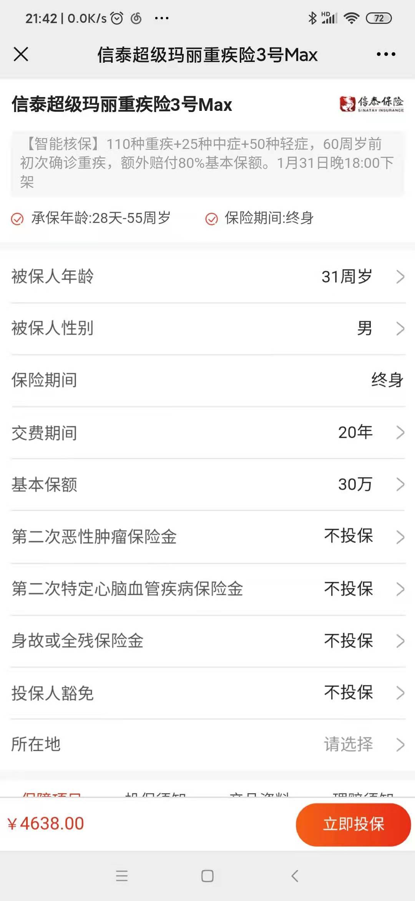

[达尔文3号重大疾病保险-不含身故 - 信泰人寿保险股份有限公司 - 慧择保险网](https://www.huize.com/apps/cps/index/product/detail?DProtectPlanId=104531&prodId=101961&planId=104531)

其中关于：

* 投保人保费豁免：不含
  * 解释：
    * 被保险人豁免保险费
      * 豁免后期保险费
        * 被保险人因意外伤害或于等待期90天后，被保险人确诊合同所列的重疾（选择恶性肿瘤扩展或特定心脑血管疾病扩展责任时）、中症、轻症，豁免余后续未交的各期保险费，保障继续有效。

[友邦人寿](https://e.aia.com.cn/estore/jsp/index.jsp)

在线网页中没有重疾险
