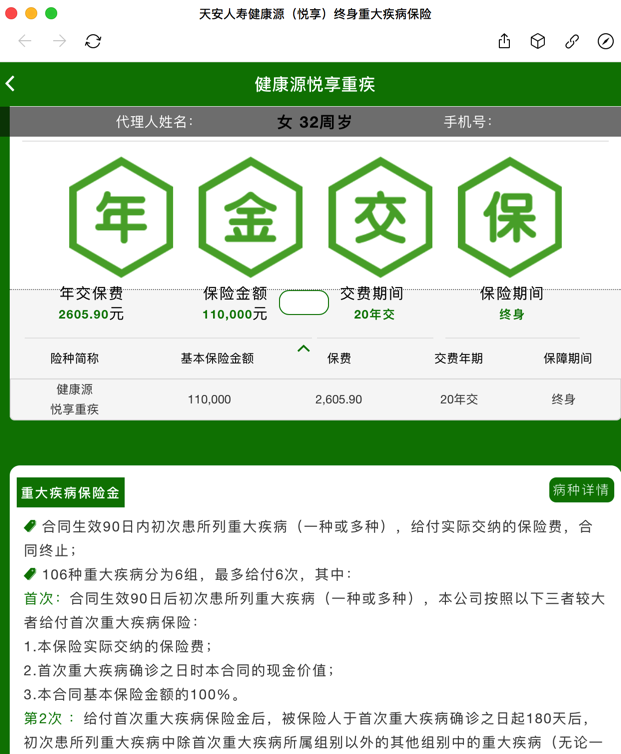
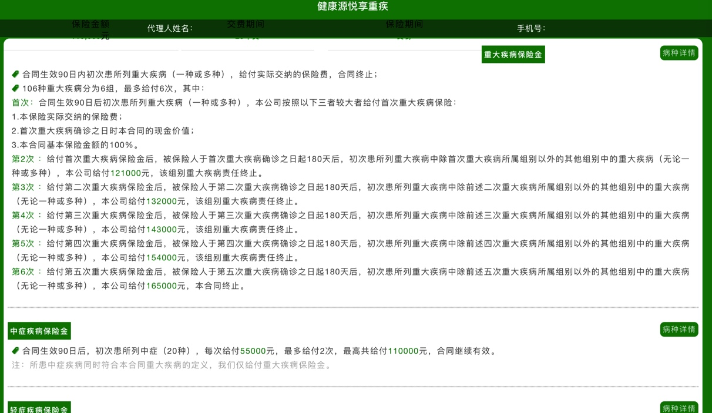
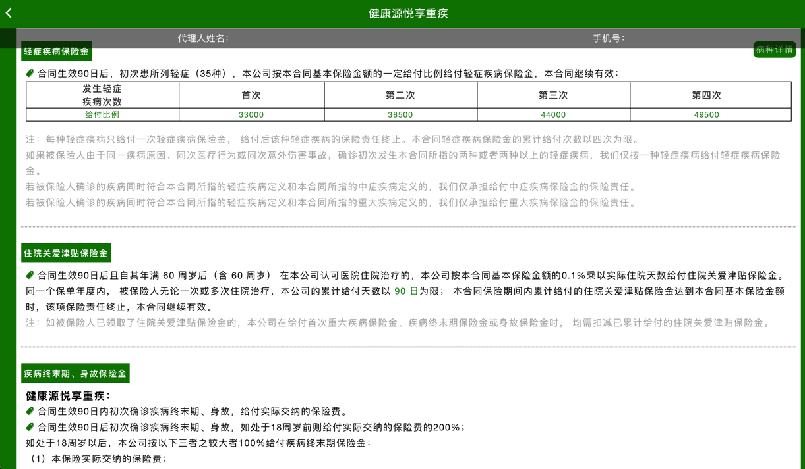

# 天安人寿 重疾险

[天安人寿 健康源悦享 重疾](http://jys.tianan-life.com/tiananClient/jkyYueX/#/ausTreeXin/331220180818193633038)

即：

* 32周岁 女 交 20年 保`11万`
  * 保费：`2605.9`元/年
    * 说明：但是万一多次发生重疾了，且是不同种类的病，最多可以赔6次，每次都是11万左右
