## 平安财险

## 房屋险主要内容

* 房屋险：`平安百万家财顺损失险` = `平安支付宝百万家庭财产损失保险`
  * `平安支付宝百万家庭财产损失保险B计划`
    * 保额：**200万**
    * 保费：88元/年
    * 主要内容
      * 房屋主体损失：200万元
      * 房屋装修损失：15万元
      * 室内财产损失：8万元
      * 盗抢综合险：2万元
      * 水暖管爆裂：1万元
    * 电子保单
      * 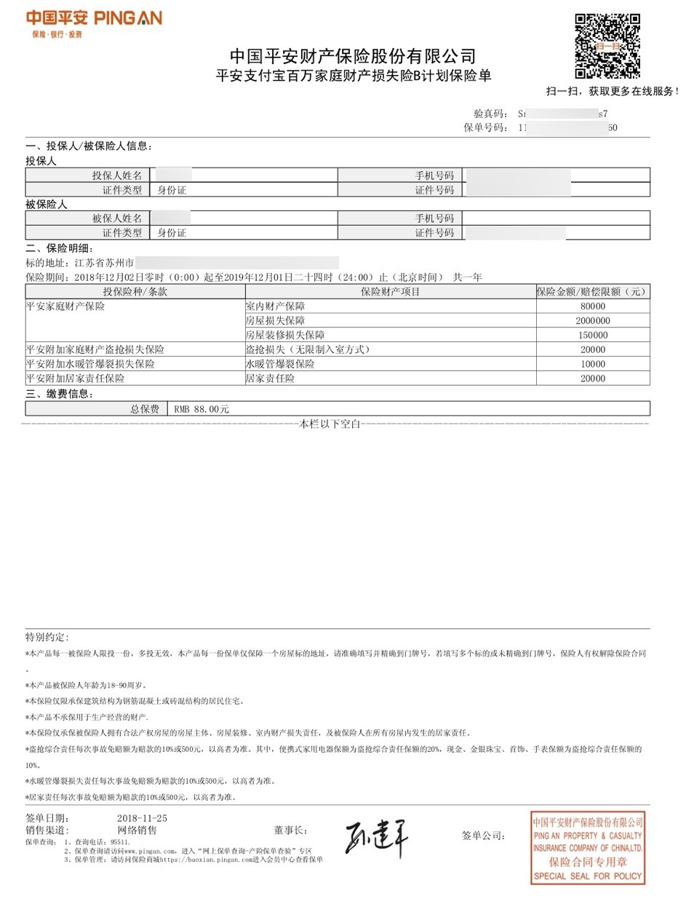
  * `平安支付宝百万家庭财产损失保险D计划`
    * 保额：**500万**
    * 保费：358元/年
    * 主要内容
      * 房屋主体损失：500万元
      * 房屋装修损失：50万元
      * 室内财产损失：20万元
      * 盗抢综合险：15万元
      * 水暖管爆裂：5万元
    * 保单详情
      * 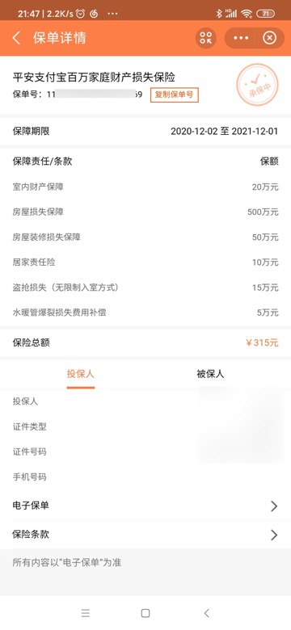

## 支付宝中续保平安保险的房屋财产险

接到平安保险人员电话，通知我可以趁双11，续保房屋险，可以有8折优惠，所以去续保：

支付宝中搜`平安保险`

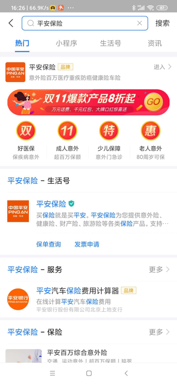

进入后，找到 房屋险：`财产`->`平安百万家财顺损失险`

进入后，选保500万的：

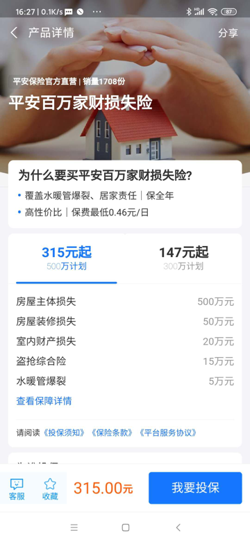

记得把生效日期改为 去年保险失效日 20201201 的 第二天  20201202

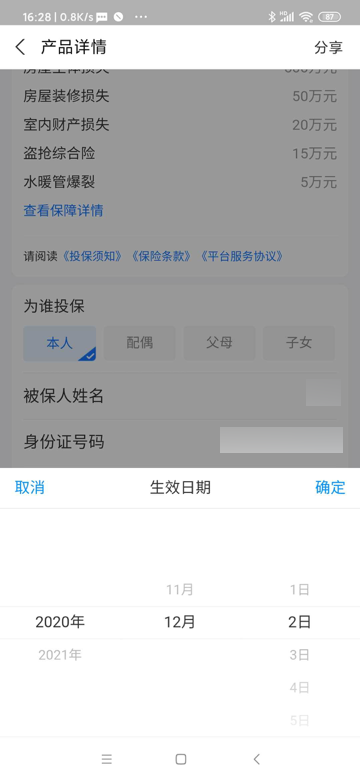

> #### info:: 看看去年的房屋险
> 
> 后来回去看了看，去年的是：
> 
> 2019-12-02 到 2020-12-01
> 
> 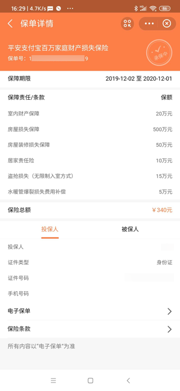
> 
> 去年买的价格是：**340**

今年总价竟然涨到了**358**

不过这次活动`8.8折`后是**315**元

算是比去年便宜`340-315`=**25**元

继续投保：

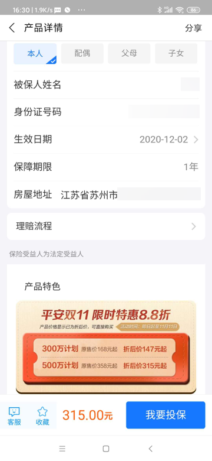

同意协议：

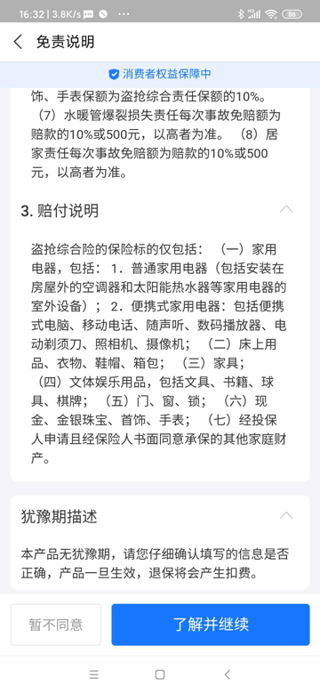

付款：

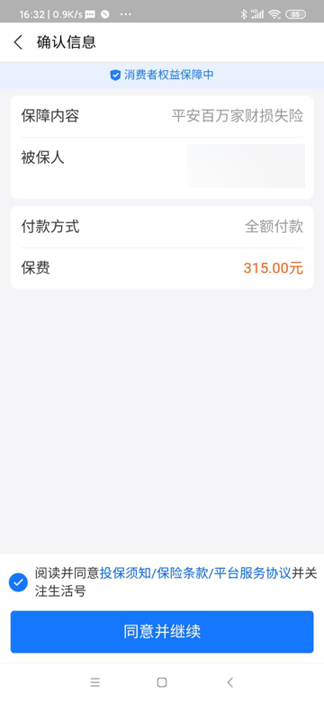

完成后，可以在`蚂蚁保险`里可以看到：

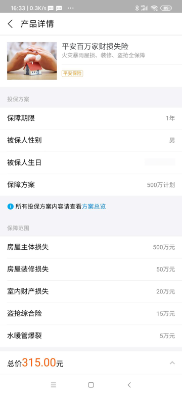

查看最新情况：

`支付宝`->搜`平安保险` -> 进入`生活号`->`我的服务`->`保单查询`->`我的保单`->即可查到`平安支付宝百万家庭财产损失保险D计划`

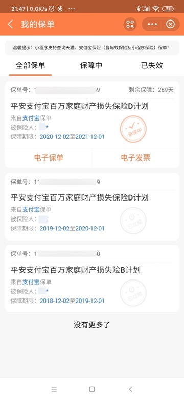

保单详情：

