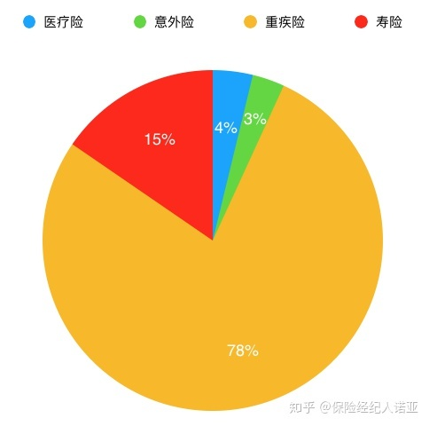
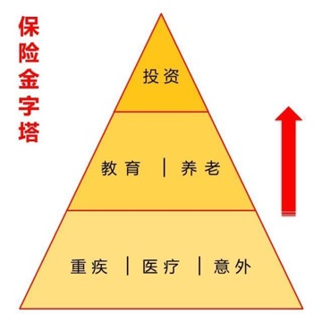

# 常见保险种类

* 最大头：`重疾险`
  * 保的疾病种类
    * 肯定包含：`重症`
    * 往往附带：`轻症`
      * 
  * 种类
    * `消费型`
      * 通常只含疾病保障，而不含身故保障
      * 赔：只有罹患合同约定的疾病时，保险公司才会赔偿
      * 不赔：如果到期没有出险，保费就消耗掉了，保险公司不会返还任何费用
      * 优点
        * 价格便宜
          * 用较少的保费就能买到充足的保额
    * `储蓄型`
      * 一般是终身保障，既含疾病责任，也含身故责任
      * 优点
        * 不管被保人身故还是重疾都可以赔付保额（部分是赔保费）
          * 原因
            * 因为人终有一死，这类保险无论如何都会赔付
            * 所以保单后期现金价值较高，能起到一定的储蓄作用
              * 年老时可退保，当做养老金使用
      * 缺点
        * 价格相对贵
    * `返还型`
      * 不仅能够提供重疾、身故的保障，到一定的年龄时没出险，还能返还保费或保额
      * 特点
        * 一般来说合同里有`两全`二字
        * 本质上是个`生死两全合同`
      * 评价
        * 看似很好，但其实并不划算
* 其次：`寿险`=`定寿险`
* 其他小的
  * `意外险`
  * `医疗险`

## 现状

* 买保险 
  * 保险支出平均占比
    * 

## 层次

* 保险金字塔
  * 
