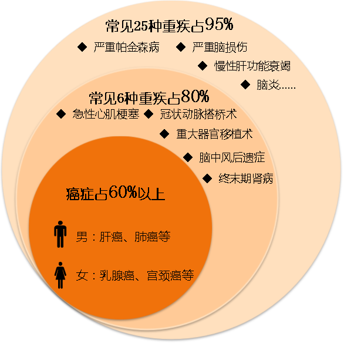
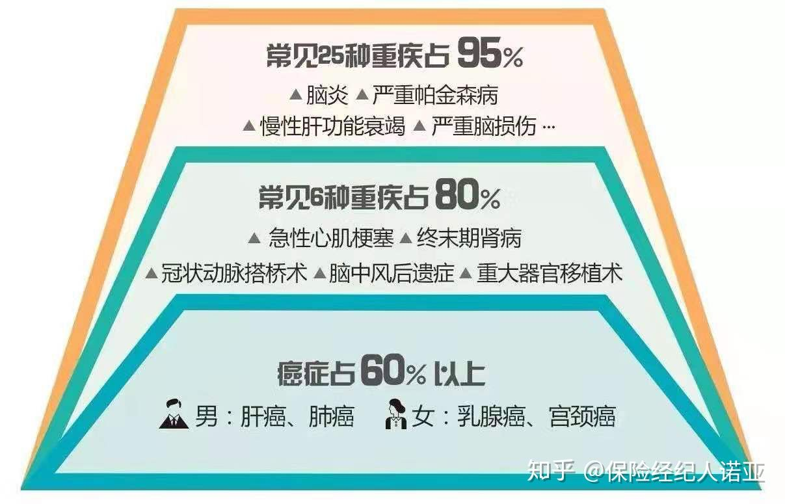

# 重疾险

## 背景知识

* 我们一生罹患重疾的概率约为72%
  * 至少还有28%的概率不会得重疾
  * 患病的年纪主要为60岁之后
* 且患了病，未必全部属于重疾险理赔的范围
  * 即 要满足条件，才理赔
  * 否则无法触发重疾理赔条件

## 重疾险基础知识

* **25种**常见重疾
  * 谁规定的：保险行业协会
    * 《重大疾病保险的疾病定义使用规范》 统一规定
  * 特点：
    * 强制的
      * 在国内任何一家保险公司购买重疾产品，都会包含这25种重疾
  * 补充
    * 只有这25种疾病以外的病种，才可以由各家保险公司自行定义
  * 为何规定：这25种是最高发的重大疾病
    * 得了重疾的95%的人都是这25种疾病之一
      * 
    * 重疾保障常见疾病发病率
      * 
  * 包含哪些
    * 恶性肿瘤(常见的恶性肿瘤有：鼻咽癌、肺癌、食管癌和贲门癌、胃癌、原发性肝癌、大肠癌、乳腺癌、恶性淋巴瘤)、急性心肌梗塞、脑中风后遗症、重要器官移植或造血干细胞移植术(肾脏移植、心脏移植、肺移植、肝移植、骨髓移植)、冠状动脉搭桥术、终末期肾病（尿毒症）、多个肢体缺失、急性或亚急性重症肝炎、良性脑肿瘤、慢性肝功能衰竭失代、脑炎后遗症、深度昏迷、双耳失聪、双目失明、瘫痪、心脏辨膜手术、严重阿尔茨海默病、严重脑损伤、严重帕金森病、严重Ⅲ度烧伤、严重原发性肺动脉高压、严重运动神经元病、语言能力丧失、重型再生障碍性贫血、主动脉手术。

## 重疾`理赔`=`赔付`

### 赔付分类

* 重疾理赔分三类 = 重疾赔付的3种状态
  * `术前陪`=`确诊即赔`
    * 例如
      * `癌症`
      * 急性或亚急性`重症肝炎`
      * Ⅲ度严重烧伤
      * 多个肢体缺失
  * `术后陪`=`术后赔付`=`实施约定手术`=`已经实施过特定的手术`
    * 例如
      * `主动脉手术`
      * `冠状动脉搭桥手术`
        * 严重冠心病赔付冠状动脉搭桥手术
      * `心脏瓣膜手术`
      * `器官衰竭` 赔付 器官移植
  * 达到某种约定状态 = 持续一段时间后看疾病状态是否符合理赔标准
    * 例如
      * 急性心肌梗塞
      * 严重脑损伤
      * 双目失明
      * `脑中风后遗症`
        * 脑中风（高发） 赔付 脑中风后遗症
      * `脑炎或脑膜炎` 赔付 脑炎后遗症或脑膜炎后遗症

### 赔付说明

* 不是所有的重疾并非确诊就能赔，而是需要符合一定条件
  * 举例
    * 终末期肾病，需要达到透析90天以上才能赔付
* 重疾险可以累计赔付
  * 举例
    * 之前有个朋友买了2份重疾险，出险后只理赔了一个保单，我问他为什么没有两个都理赔，他说以为重疾险和医疗险一样，只能理赔一次，后来在指导下，他的两张保单都进行了赔付。
  * 原则：
    * 重疾险：给付型保险
      * 出险后可以累积赔付，也就是一张保单50万，2张能赔100万
    * 医疗险：损失补偿型产品
      * 社保报销后，商业医疗险只报销一次
