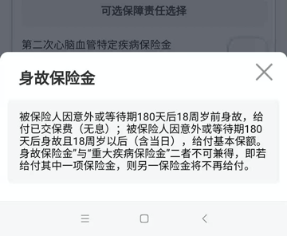

# 身故保险金

## 背景

在买重疾险期间，往往会有个选项是`身故保险金`

比如对于`百年人寿`的小程序中的某款`康惠保`

同样选项：交20年 保终身 保额20万

* 不加 身故保险金 只要：3298元
  * 
* 加了 身故保险金，要贵很多：4990元
  * 

差额=`4990`-`3298`=1692元

虽然看到解释：

> 被保险人因意外或等待期180天后18周岁前身故，给付已交保费（无息）；
> 
> 被保险人因意外或等待期180天后身故且18周岁以后（含当日），给付基本保额。
> 
> `身故保险金`与`重大疾病保险金`不可兼得，即若给付其中一项保险金，则另一保险金不再给付。

但是不太懂。感觉是： 这个身故保险金 和 一年只要100+的 保100万+的 意外险 有何区别？

## 身故保险金

* 由于重疾险不是所有的并都包括，所以可能会出现下面情况
  * 我国心脑血管疾病的致死率在所有疾病中最高
    * 而且发病率占比高达35%左右
      * 如果心脑血管疾病直接导致被保险人身故的话
        * 不带身故责任 的重疾险无法理赔
          * 买了重疾险也不起作用
  * 举例
    * A先生在5、60时罹患脑中风或其他不是确诊即赔的疾病
      * 经过大量治疗，钱也花了不少结果还是身故了
        * 不属于：脑中风（术后还活着，且）后遗症，所以不赔

## 举例说明：身故保险金

* 买了重疾险 保额20万，保费每年3000元
  * 不带 身故保险金= 无身故（保险）责任
    * 得了大病
      * 属于重疾（比如癌症等）的，给赔
        * -> 保险公司赔付你基本保额（20万）
      * 不属于重疾（比如心脑血管疾病等），不赔
        * -> 保险公司不赔你任何钱
    * 直到死，没发生大病， 不赔
      * -> 保险公司不赔你任何钱
  * 带 身故保险金 = 有身故（保险）责任
    * 得了大病
      * 属于重疾（比如癌症等）的，给赔
        * -> 保险公司赔付你基本保额（20万）
    * 身故了
      * 可能原因
        * 原因1：得了大病（但不属于重疾，比如心脑血管疾病等，最后）治疗无效，身故了 -》给赔
        * 原因2：正常老死（没发生大病） -》给赔
        * 原因3：（老死之前）发生了意外导致死亡 -》给赔
      * 赔多少
        * 年龄不满18岁：赔你之前已交的保费
          * 举例：之前每年交3000元，已交3年，一共交了9000元的保费 -》赔你9000元
            * 此时 = 身故赔保费
              * 万一人不在了，可以拿回累计的已交保费
                * 相当于“回本”了
        * 年龄超过18岁：赔你保额
          * 举例：之前每年交3000元，保额20万-》赔你20万
            * 此时：身故保险金=身故赔保额
      * 注意：
        * 如果已身故，则是其他人（比如你的亲属）拿着你的保单去找保险公司去理赔
      * 不论什么情况，身故保险金 和 重大疾病保险金，如果赔了一个，另外就不再陪了
